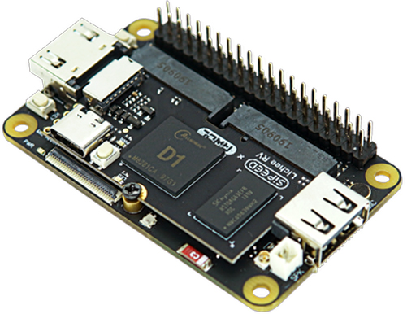

# Мигаем светодиодами и разбираемся, как Linux разговаривает с железом

Обычно знакомство с железом начинают с мигания светодиодом. Казалось бы,
что тут разбирать: включили, немного подождали, выключили. Повторили
несколько раз — и первое знакомство с платой состоялось.

Но в Linux светодиод можно включить записью единицы в файл. И вот это
уже выглядит немного странно. Каким образом текст в терминале превращается
в электрический сигнал? Кто на самом деле переключает контакт платы?
И что изменится, если вместо команд терминала взять Python или библиотеку?

Попробуем пройти этот путь целиком. В нашем распоряжении уже знакомая
**Lichee RV Dock** на Allwinner D1 с Linux и два встроенных светодиода:
обычный зелёный на модуле и RGB на плате Dock.



У платы есть и оранжевый индикатор питания, но программно управлять им
нельзя. Для наших экспериментов понадобятся именно зелёный и RGB.

## Оглавление

- [Сначала просто включим светодиод](#сначала-просто-включим-светодиод)
- [Что это за файлы в sys](#что-это-за-файлы-в-sys)
- [Кто на самом деле включает свет](#кто-на-самом-деле-включает-свет)
- [Откуда Linux знает о светодиоде](#откуда-linux-знает-о-светодиоде)
- [Добавим мигание](#добавим-мигание)
- [А можно без работающей программы](#а-можно-без-работающей-программы)
- [Теперь воспользуемся библиотекой](#теперь-воспользуемся-библиотекой)
- [Посмотрим что находится под капотом](#посмотрим-что-находится-под-капотом)
- [Перейдём к RGB](#перейдём-к-rgb)
- [Что в итоге произошло](#что-в-итоге-произошло)

## Сначала просто включим светодиод

Плату мы заранее подготовили: установили ядро с названием`6.16.0-onboard-io-lab`
и описание оборудования для Lichee RV Dock. Подробности этой подготовки
есть в [README](README.md). Сейчас интереснее посмотреть на уже работающую
систему, чем начинать с пересборки ядра.

Подключаемся к плате через UART. На компьютере преобразователь виден
как `/dev/ttyUSB0`; скорость соединения — 115200 бод. Если используем `tio`,
команда **на компьютере** выглядит так:

```bash
tio -b 115200 /dev/ttyUSB0
```

После входа перед нами терминал Linux, который работает **на плате**.
Дальнейшие команды будем выполнять именно там, в подготовленной root-сессии.
Наш компьютер передаёт символы по UART и показывает ответ. Python и
команды Linux запускаются уже на процессоре платы.

Посмотрим, какие светодиоды доступны системе:

```bash
ls /sys/class/leds
```

На нашем стенде получаем:

```text
green:status  rgb:status
```

Начнём с зелёного:

```bash
echo none > /sys/class/leds/green:status/trigger
echo 1 > /sys/class/leds/green:status/brightness
```

Светодиод загорелся! Первая команда отключила автоматическое управление —
к этому ещё вернёмся. Вторая установила состояние светодиода.
Теперь выключим его:

```bash
echo 0 > /sys/class/leds/green:status/brightness
```

Пока всё действительно просто. Но стоит обратить внимание на один момент:
команда `echo 1` уже закончилась, а светодиод продолжал светиться.
Программа не обязана работать всё время, чтобы удерживать установленное
состояние устройства.

## Что это за файлы в sys

В обычной работе запись в файл означает, что мы сохраняем данные:
например, текст заметки на диск. Здесь происходит другое.

`/sys` — это **sysfs**, виртуальная файловая система, через которую
ядро Linux показывает устройства и их свойства. Её содержимое формируется
ядром, а не читается как набор обычных текстовых файлов с SD-карты.
Названия похожи на файлы, но за чтением и записью стоят специальные
обработчики в ядре.

Посмотрим свойства нашего светодиода:

```bash
ls /sys/class/leds/green:status
cat /sys/class/leds/green:status/max_brightness
cat /sys/class/leds/green:status/brightness
```

`cat` читает содержимое указанного файла. Для `max_brightness` получаем `1`:
у этого светодиода через данный интерфейс доступны только выключенное
и включённое состояния. Имя `brightness` можно перевести как «яркость»,
но оно не обещает, что каждый LED умеет плавно её регулировать.

Путь `/sys/class/leds` объединяет устройства **LED class**, то есть класса
светодиодов. Это общий интерфейс Linux: приложению предлагают свойства
светодиода независимо от того, как именно он подключён.

А что означало `echo 1 > ...`? `echo` выводит текст, а знак `>` перенаправляет
этот вывод в файл. Командная оболочка открывает указанный путь, и туда
передаются символ `1` и перевод строки. Для обычного файла это было бы
сохранением текста. Для атрибута `brightness` это запрос ядру изменить LED.

**Мы использовали запись в файл как интерфейс управления устройством.**

## Кто на самом деле включает свет

Сделаем небольшое отступление. У нашей платы есть процессор, память и
периферийные устройства, а Linux должен организовать их совместную работу.
Главная часть операционной системы, которая этим занимается, — **ядро**.
Оно управляет выполнением программ, памятью и доступом к оборудованию.

Обычные программы выполняются в **пользовательском пространстве**.
Чтобы открыть файл, прочитать данные или записать их, программа обращается
к услугам ядра. Такое обращение называется **системным вызовом**.
Нам пригодятся названия `open` или `openat` для открытия, `read` для чтения,
`write` для записи и `close` для закрытия.

Но одного общего умения «записывать в файл» ядру недостаточно, чтобы
управлять любым устройством. Нужно знать, какое железо стоит за запросом.
За это отвечает **драйвер** — код ядра, который реализует работу с
определённым устройством или типом устройств.

Зелёный LED подключён к контакту **PC1**. Здесь C — банк контактов,
а 1 — номер контакта внутри банка. Это обозначение вывода процессора,
а не номер ножки на разъёме. Для него используется GPIO:
**General-Purpose Input/Output**, цифровой контакт общего назначения.
Настроенный как выход GPIO может выдавать низкий или высокий уровень.
В подключении нашего LED высокий уровень означает включение.

Сам GPIO управляется аппаратным **контроллером** внутри Allwinner D1.
Контроллер — это блок микросхемы, который выполняет конкретную работу.
Его настройки находятся в **регистрах**, специальных ячейках состояния
железа. Драйвер знает, как менять эти настройки.

Теперь наша короткая команда раскрывается в цепочку:

```text
echo 1
   ↓
запись в brightness через системный вызов
   ↓
sysfs и LED class в ядре
   ↓
драйвер gpio-leds и GPIO-драйвер
   ↓
GPIO-контроллер устанавливает уровень на PC1
   ↓
светодиод загорается
```

Поэтому программе не понадобилось знать адрес GPIO-регистра в памяти.
Она сообщила желаемое состояние через интерфейс ядра, а аппаратные
подробности обработали драйверы. Внутри ядра часть работы может выполняться
через очередь; запись не обязательно означает, что вся аппаратная
операция завершилась прямо в этот момент.

Кстати, если переписать эту программу с Python на C, драйвер никуда не
исчезнет. Язык приложения и способ подключения устройства — разные вопросы.

## Откуда Linux знает о светодиоде

Есть ещё одна неочевидная часть истории. У процессора много контактов,
а один и тот же контакт часто может выполнять несколько функций.
Как ядро узнаёт, что к PC1 производитель подключил именно светодиод?

Для нашей платы эту информацию передаёт **Device Tree**, дерево устройств.
Это описание оборудования и его соединений. Оно сообщает ядру, какие
устройства есть на плате, какие ресурсы им нужны и как они подключены.

Описание, которое удобно читать человеку, хранится в **DTS**.
После компиляции получается **DTB** — двоичный файл. Загрузчик передаёт
DTB ядру вместе с образом ядра `Image`.

В DTS модуля Lichee RV уже есть такой фрагмент:

```dts
leds {
    compatible = "gpio-leds";
    led-0 {
        color = <LED_COLOR_ID_GREEN>;
        function = LED_FUNCTION_STATUS;
        gpios = <&pio 2 1 GPIO_ACTIVE_HIGH>; /* PC1 */
    };
};
```

Строка `compatible = "gpio-leds"` позволяет выбрать подходящий драйвер.
`gpios` указывает GPIO-контроллер `pio`, банк C с номером 2,
контакт 1 и активный высокий уровень. Цвет и назначение участвуют
в формировании имени `green:status`.

Если нужный драйвер включён в ядре, он получает описание, регистрирует
светодиод, и в sysfs появляется знакомый нам каталог.

```text
DTS → DTB → загрузчик → ядро → драйвер → /sys/class/leds/green:status
```

Сам Device Tree светодиодом не мигает: в нём нет нашего цикла с паузами.
Он объясняет ядру, **что подключено**, а драйвер реализует, **как этим управлять**.

Это оказалось важно и при подготовке нашего стенда. Изначально плата
загружалась с описанием, в котором подходящие LED-драйверы не были включены в состав ядра а dtb не содержало достаточной информации о лампочках.

В рабочем комплекте мы использовали образ с
нужными драйверами и DTB для Lichee RV Dock, дополненный описанием RGB LEDC.

## Добавим мигание

Теперь вернёмся к тому, ради чего всё начали. Для мигания нужно повторять
две записи, оставляя между ними паузы. Вот наш простой пример
[`green_sysfs.py`](lesson_examples/green_sysfs.py):

```python
from pathlib import Path
from time import sleep

led = Path("/sys/class/leds/green:status")
maximum = led.joinpath("max_brightness").read_text().strip()
led.joinpath("trigger").write_text("none\n")

try:
    for _ in range(5):
        led.joinpath("brightness").write_text(maximum + "\n")
        sleep(0.5)
        led.joinpath("brightness").write_text("0\n")
        sleep(0.5)
except KeyboardInterrupt:
    pass
finally:
    led.joinpath("brightness").write_text("0\n")
```

Необязательно знать весь синтаксис Python, чтобы понять происходящее.
`Path` задаёт путь, `read_text` читает текст, `write_text` его записывает.
`joinpath` добавляет имя нужного свойства к каталогу LED.
Файл при такой записи открывается и закрывается автоматически.

Мы читаем максимальную яркость, пять раз включаем LED, ждём полсекунды,
выключаем и снова ждём. Каждый цикл занимает примерно секунду.
`finally` содержит действие на выходе — выключение светодиода.
При Ctrl-C Python получает `KeyboardInterrupt`, прекращает цикл
и также выполняет выключение.

Три учебных файла уже лежат на подготовленной плате. Перейдём в их каталог
и запустим первый:

```bash
cd /root/onboard-io-install/lesson_examples
python3 green_sysfs.py
```

Зелёный LED пять раз мигнёт и погаснет. Эти примеры рассчитаны на имена
устройств нашего стенда и обычный запуск или остановку через Ctrl-C.
Принудительное завершение процесса не всегда позволяет выполнить очистку.

Кто теперь определяет момент переключения? **Наша программа.** Она просит
ядро подождать, затем делает следующую запись. Но `sleep(0.5)` не гарантирует,
что процесс продолжит работу ровно через 500 миллисекунд: ядро также
выполняет другие задачи. Для видимого мигания это нормально. Для очень
точной передачи импульсов такой способ может оказаться неподходящим.

## А можно без работающей программы

Теперь интересный поворот: LED умеет мигать, даже если мы не оставим
работающий Python-цикл.

Помните свойство `trigger`, в которое в начале записали `none`?
**Trigger** — источник событий для светодиода внутри ядра. Он позволяет
связать LED с готовым поведением: например, активностью устройства
или периодическим таймером.

Посмотрим доступные варианты:

```bash
cat /sys/class/leds/green:status/trigger
```

Текущий вариант выделен квадратными скобками. На нашем ядре среди
вариантов есть `timer`. Выберем его и зададим интервалы:

```bash
echo timer > /sys/class/leds/green:status/trigger
echo 500 > /sys/class/leds/green:status/delay_on
echo 500 > /sys/class/leds/green:status/delay_off
```

Свойства `delay_on` и `delay_off` появляются после выбора `timer`.
Значения здесь задаются **в миллисекундах**. Команды завершились,
мы снова видим приглашение терминала, а светодиод продолжает мигать.

Работу выполняет таймер LED-подсистемы ядра. Для нашего GPIO LED это
программный таймер, а не отдельная аппаратная схема, которая мигает
сама без участия процессора. Однако нашему пользовательскому процессу
больше не нужно просыпаться ради каждой записи.

Получается, одинаковый внешний результат можно получить на разных уровнях:
первый раз последовательность определял Python, второй — ядро.
Trigger тоже не даёт обещания идеальной точности времени, но избавляет
приложение от реализации стандартного поведения.

Перед следующим экспериментом остановим его:

```bash
echo none > /sys/class/leds/green:status/trigger
echo 0 > /sys/class/leds/green:status/brightness
```

## Теперь воспользуемся библиотекой

Работа с файлами понятна, но каждый раз собирать пути и преобразовывать
значения в строки не очень удобно. Здесь пригодится **библиотека** —
готовый код, который предоставляет программе более удобные операции.

Для нашего LED возьмём библиотеку проекта `python-periphery`.
В ALT Linux она поставляется пакетом **`python3-module-periphery`**,
а импортируется как **`periphery`**. У неё есть класс `LED`, который умеет
работать со светодиодами Linux.

Установим пакет из текущего Sisyphus для RISC-V — репозитория,
из которого пакетный менеджер дистрибутива получает программы.
В root-сессии платы выполним:

```bash
apt-get update
apt-get install python3-module-periphery
unset PYTHONPATH PYTHONHOME
python3 -c 'import periphery; print(periphery.__version__); print(periphery.__file__)'
```

Первая команда обновляет список доступных пакетов, вторая устанавливает
библиотеку. `unset` убирает ранее заданные пути поиска Python, чтобы
случайно не подхватить другую копию библиотеки.

Теперь посмотрим [`green_library.py`](lesson_examples/green_library.py):

```python
from pathlib import Path
from time import sleep
from periphery import LED

Path("/sys/class/leds/green:status/trigger").write_text("none\n")

led = LED("green:status")
try:
    for _ in range(5):
        led.write(True)
        sleep(0.5)
        led.write(False)
        sleep(0.5)
except KeyboardInterrupt:
    pass
finally:
    led.write(False)
    led.close()
```

```bash
python3 green_library.py
```

Внешне ничего не изменилось: те же пять миганий. Но теперь мы говорим
`led.write(True)` вместо записи текстовой единицы в `brightness`.
Для этого класса `True` означает максимальную яркость, а `False` — ноль.
Библиотека сама читает допустимый максимум и занимается записью значения.

`LED("green:status")` создаёт объект и открывает ресурс для управления.
В конце мы вызываем `led.write(False)` и `led.close()`.
Важная тонкость: **выключить устройство и закрыть ресурс — не одно и то же**.
Библиотека не обязана гасить светодиод при закрытии, поэтому в `finally`
мы явно выполняем оба действия. Trigger тоже отключаем отдельно:
этот класс не управляет свойством `trigger`.

Явное создание объекта здесь важно ещё и для совместимости с версией
из репозитория. Проверка показала, что её конструкция
`with LED(...) as led` не передаёт объект в переменную `led`.
Поэтому используем приведённый выше вариант с `try` и `finally`.

Получился ещё один слой, но остальная цепочка сохранилась:

```text
Python → periphery.LED → sysfs → драйвер → контроллер → светодиод
```

Библиотека не заменяет драйвер и не создаёт устройство, которого нет
в ядре. Если у процесса нет прав на запись, библиотека тоже не сможет
«обойти» это ограничение. Она делает обращение удобнее, а не отменяет
правила доступа.

Кстати, если уже слышали про `libgpiod`, может возникнуть вопрос:
почему мы не используем её? Эта библиотека работает с GPIO через
современный интерфейс `/dev/gpiochip*`. Но PC1 на нашей плате уже занят
драйвером `gpio-leds`. Пытаться параллельно запросить его как свободную
GPIO-линию означает конфликт владения. Для зарегистрированного LED
логичнее использовать LED class, для свободного контакта — GPIO-интерфейс.

И ещё одно различие: старый GPIO sysfs `/sys/class/gpio` и наш
LED sysfs `/sys/class/leds` — разные интерфейсы. Устаревание первого
не означает, что управление LED class устроено через тот же старый GPIO API.

## Посмотрим, что находится под капотом

Пока утверждение «библиотека тоже записывает файл» можно было принять
на слово. Но у Linux есть удобный инструмент **strace**, который показывает
системные вызовы процесса. Проверим наш библиотечный пример:

```bash
strace -f -yy -e trace=openat,write,lseek,close -o /tmp/green-library.trace \
  python3 green_library.py
grep 'green:status' /tmp/green-library.trace
```

В трассировке есть строки такого вида:

```text
write(3</sys/devices/platform/leds/leds/green:status/brightness>, "1\n", 2) = 2
write(3</sys/devices/platform/leds/leds/green:status/brightness>, "0\n", 2) = 2
```

Тройка здесь — **файловый дескриптор**, номер открытого ресурса,
который ядро выдало процессу. Затем программа обращается к этому ресурсу
по номеру. Двойка означает два записанных байта: цифру и перевод строки.
В другом запуске номер дескриптора может отличаться.

Почему путь теперь начинается с `/sys/devices`, а не с `/sys/class/leds`?
Каталог класса содержит символическую ссылку — путь, который указывает
на другой путь, связанный с конкретным устройством. `strace` подписал
дескриптор уже разрешённым путём. Посмотреть его отдельно можно так:

```bash
readlink -f /sys/class/leds/green:status
```

Для прямого примера запустим ту же проверку:

```bash
strace -f -yy -e trace=openat,write,lseek,close -o /tmp/green-sysfs.trace \
  python3 green_sysfs.py
grep 'green:status' /tmp/green-sysfs.trace
```

Там также видны записи `1` и `0` в `brightness`.

## Перейдём к RGB

С зелёным LED разобрались. Теперь возьмём RGB: он содержит красный,
зелёный и синий каналы, сочетанием которых можно задавать разные цвета.

На Dock установлен **WS2812C-2020**. Это адресный светодиод со своей
управляющей схемой. Ему недостаточно постоянно подать высокий уровень
на провод. Нужно передать последовательность битов с определёнными
длительностями импульсов.

Но начнём снова с файлов:

```bash
cat /sys/class/leds/rgb:status/max_brightness
cat /sys/class/leds/rgb:status/multi_index
```

Получаем:

```text
255
red green blue
```

Здесь максимум уже 255. `multi_index` сообщает порядок компонент,
а свойство `multi_intensity` принимает значения сразу для всех трёх.
В нашем случае `255 0 0` означает красный, `0 255 0` — зелёный,
`0 0 255` — синий. На другой плате порядок может отличаться, поэтому
сначала мы его прочитали, а не угадали.

`brightness` задаёт общую яркость. При максимуме 255 значение канала
вычисляется примерно так:

```text
яркость канала = brightness × интенсивность канала / 255
```

Если записать `255 0 0` и общую яркость 31, красный канал получит 31,
остальные — ноль. Получается, цвет и общую яркость можно менять отдельно.

Покажем четыре цвета в [`rgb_sysfs.py`](lesson_examples/rgb_sysfs.py):

```python
from pathlib import Path
from time import sleep

led = Path("/sys/class/leds/rgb:status")
assert led.joinpath("multi_index").read_text().split() == ["red", "green", "blue"]
led.joinpath("trigger").write_text("none\n")
led.joinpath("brightness").write_text("0\n")

try:
    for color in ("255 0 0", "0 255 0", "0 0 255", "255 255 255"):
        print(color, flush=True)
        led.joinpath("multi_intensity").write_text(color + "\n")
        led.joinpath("brightness").write_text("31\n")
        sleep(1)
except KeyboardInterrupt:
    pass
finally:
    led.joinpath("brightness").write_text("0\n")
```

```bash
python3 rgb_sysfs.py
```

Каждый цвет держится секунду: красный, зелёный, синий, затем белый.
Для белого включаем все три канала; это демонстрация смешения,
а не точная калибровка цвета. Проверка `assert` в начале останавливает
пример, если порядок компонент отличается от ожидаемого.
Запускаем обычным `python3`, без режима `-O`, который отключает такие проверки.

Но где в нашей программе точные импульсы передачи? Их там действительно
нет. Эту работу выполняет аппаратный **LEDC**, контроллер светодиодов
Allwinner D1. В описании платы мы назначили контакту PC0 функцию `ledc`
и добавили описание контроллера: адрес регистров, тактирование,
сброс и прерывание.

Драйвер `leds-sun50i-a100` загружает данные в **FIFO** — буфер, из которого
контроллер по порядку забирает значения для передачи. Для одного пикселя
данные загружает процессор; аппаратный LEDC уже формирует точные импульсы.

```text
Python задаёт цвет
   ↓
LED multicolor и драйвер LEDC
   ↓
данные попадают в FIFO
   ↓
контроллер формирует импульсы на PC0
   ↓
WS2812 принимает новый цвет
```

После передачи контроллер сообщает драйверу о её завершении через
**прерывание** — аппаратное уведомление ядру. Счётчик можно увидеть:

```bash
grep -i led /proc/interrupts
python3 rgb_sysfs.py
grep -i led /proc/interrupts
```

При проверке нашего примера счётчик действительно увеличивался.
Это ещё один способ увидеть, что за файлами sysfs стоит работа
аппаратного устройства.

На проводе WS2812 используется порядок **GRB**, хотя в `multi_index`
мы видим **RGB**. Противоречия нет: первое — порядок передачи,
второе — порядок пользовательских значений. Преобразование обеспечивает
настроенный контроллер; переставлять значения в нашей программе не нужно.

Мы можем спокойно подождать секунду между цветами, но не пытаемся
формировать каждый короткий импульс Python-циклом. Программа определяет,
какой цвет нужен, а аппаратный блок отвечает за точную передачу.

Класс `LED` в `python-periphery` умеет менять общую `brightness`, но
не предоставляет отдельного интерфейса для `multi_intensity`.
Поэтому для выбора RGB-цвета мы использовали sysfs напрямую.
Возможности конкретной библиотеки нужно проверять: название ещё
не означает, что она умеет всё, что умеет драйвер.

## Что в итоге произошло

Начали мы с двух строк в терминале. Теперь за ними видна целая система:
описание платы, ядро, драйверы, интерфейс устройства и аппаратные блоки.

**Device Tree** сообщил, что и как подключено. **Драйвер** реализовал
управление этим оборудованием. **LED class и sysfs** дали программе
понятный способ задать состояние. **Библиотека** сделала этот способ
удобнее, а **системные вызовы** связали программу с ядром.

Для зелёного LED запрос закончился изменением уровня GPIO.
Для RGB — аппаратной передачей данных через LEDC. Снаружи мы пользовались
похожими файловыми операциями, а работа с железом внутри оказалась разной.

Если после всех опытов что-то осталось включённым, вернём исходное состояние:

```bash
echo none > /sys/class/leds/green:status/trigger
echo 0 > /sys/class/leds/green:status/brightness
echo none > /sys/class/leds/rgb:status/trigger
echo 0 > /sys/class/leds/rgb:status/brightness
```

Все три программы из этой записи проверены на нашей плате через UART:
завершились с кодом 0 и оставили светодиоды выключенными.
Мигание зелёного LED и цвета RGB также наблюдали непосредственно на плате.

Главная мысль этого небольшого эксперимента: **в Linux приложение обычно
не управляет контактом само. Оно обращается к интерфейсу ядра, а ядро
и драйверы превращают запрос в работу оборудования.** И это хороший
отправной пункт для знакомства с другими устройствами: дальше будут
меняться интерфейсы и драйверы, но необходимость понять всю цепочку останется.

## Если хочется почитать дальше

- [LED class в документации Linux](https://docs.kernel.org/leds/leds-class.html).
- [Multicolor LED class](https://docs.kernel.org/leds/leds-class-multicolor.html).
- [Документация python-periphery: LED](https://python-periphery.readthedocs.io/en/latest/led.html).
- [Подготовка нашего комплекта и подробности DTS](README.md).
- [Конспект встречи для преподавателя](lesson.md).
